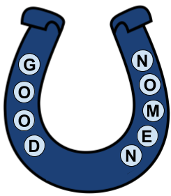

# Introduction

*Good Nomen* enables researchers to standardize tabular data against ontologies from [BioPortal](https://bioportal.bioontology.org/) via a user-friendly interface. Data values and column names can be standardized.

# Demo Version

You can try Good Nomen [here](https://bioapps.byu.edu/GoodNomen). The demo server has a file-upload limit of 10 megabytes.

If you would like, you can use [this example data file](/example_data/nationwidechildrens.org_clinical_drug_brca.tsv). After uploading it to Good Nomen, indicate that the file has three header lines. When standardizing this file, we have focused primarily on the `pharmaceutical_therapy_drug_name` column.

# Installing and running Good Nomen

This repository provides scripts for executing Good Nomen within a Docker container. First, you will need to install the Docker engine (see [https://docs.docker.com/install](https://docs.docker.com/install/)).

Second, you will need to clone this repository. Then obtain an API key from [BioPortal](https://www.bioontology.org/wiki/BioPortal_Help#Getting_an_API_key). Store this in the root directory of your cloned repository in a file called `BioPortalApiKey.txt`.

Execute the `build_docker` script at the command line (this may need to be modified slightly on Windows). After the image has been built, use the `run_docker` script to start a container with Good Nomen running inside it. You should then be able to access the app at [http://localhost:80/GoodNomen](http://localhost:80/GoodNomen). You can change the port it uses by modifying `run_docker`.

# Contact Us

Please leave questions, comments, or bug reports for us [here](https://github.com/srp33/GoodNomen/issues).

This application was developed by the [Piccolo Lab](https://piccolo.byu.edu). Special thanks to [Alyssa Parker](https://medschool.vanderbilt.edu/igp/person/alyssa-parker/) for conceiving this app and working so hard on it.
